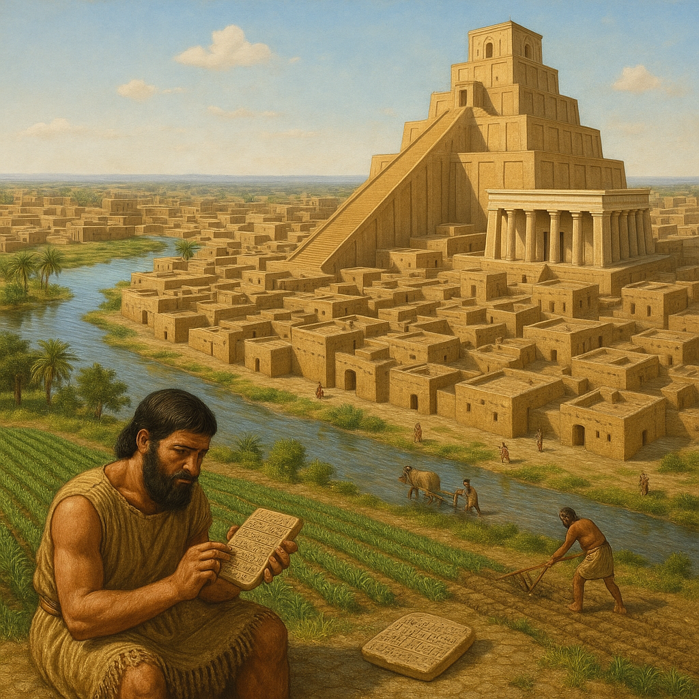

# Proyecto de Sostenibilidad Aplicada al Sector Productivo

## Integrantes del grupo
- Pedro Martínez Herrero  
- Álvaro Lozano Martínez  
- Juan Francisco Pérez Piqueras  
- Gilberto Gil Gandía  
- Alba Muñoz Miñano

## Introducción
Este proyecto forma parte de la asignatura **Sostenibilidad aplicada al sector productivo** y tiene como objetivo analizar cómo diferentes civilizaciones o sistemas han gestionado sus recursos, energía y posibilidades de supervivencia desde una perspectiva sostenible. A través de este análisis histórico y comparativo, podremos comprender qué decisiones favorecieron la sostenibilidad y cuáles condujeron a la insostenibilidad.

Con este enfoque, no solo aprenderemos del pasado, sino que también reflexionaremos sobre el presente y futuro de nuestro sector, buscando soluciones reales y responsables para los retos ambientales actuales.

---

# Sección 1: Civilización y su relación con la sostenibilidad

## 1.1. Civilización elegida: Los Sumerios
Los sumerios se asentaron en la Baja Mesopotamia, una fértil región conocida como Sumer, atraídos por sus ricos suelos y la disponibilidad de agua. El origen de este pueblo es un tema de debate académico conocido como la "cuestión sumeria"; mientras que algunas teorías postulan una migración, la evidencia arqueológica sugiere una clara continuidad cultural desde el período de El-Obait, lo que desafía la idea de una llegada súbita. Antes del 3000 a. C., fundaron ciudades-estado independientes, estableciendo una de las primeras civilizaciones con gobierno centralizado, religión organizada y, de manera crucial, la invención de la escritura, sentando así las bases para el desarrollo cultural y político del Cercano Oriente antiguo.

(MAPA SOBRE LA ZONA DE ASENTAMIENTO SUMERIO EN LA ANTIGUA MESOPOTAMIA)

  

## 1.2. Obtención de recursos
- ¿Cómo obtenían materiales, alimentos, agua, etc.?
- ¿Era sostenible?

## 1.3. Obtención de energía
    

En la civilización Sumeria, la obtención de energía estaba basada en fuentes naturales y locales, lo que podemos considerar una forma temprana de sostenibilidad.
Sus fuentes de energía principales provenían de:

·Trabajo humano: fundamental para cultivar la tierra, construir canales, templos y realizar tareas diarias, aprovechando la fuerza de las personas de manera directa. Este trabajo organizado permitió que las comunidades sumerias fueran productivas y autosuficientes.

·Fuerza animal: empleaban animales para arar los campos y transportar mercancías. Esto aumentaba la eficiencia en la agricultura y el comercio.
Los animales eran como “máquinas de energía biológica”: transformaban alimento en fuerza de trabajo, permitiendo hacer más cosas sin depender de recursos externos limitados.

·Energía hidráulica: desarrollaron sistemas de canales y riego que aprovechaban el flujo de agua de los ríos para mantener la agricultura y abastecer las ciudades. Este uso del agua como fuente de energía demuestra un aprovechamiento inteligente de los recursos naturales, contribuyendo a la sostenibilidad de la sociedad sumeria.

Gracias a estas fuentes de energía, los sumerios pudieron desarrollar una civilización organizada, eficiente y capaz de sostener a grandes poblaciones, demostrando cómo el uso equilibrado de recursos locales puede favorecer la sostenibilidad a largo plazo.

## 1.4. Posibilidades de supervivencia
- ¿Cómo se adaptaban?
- ¿Qué riesgos enfrentaban?
- ¿Qué factores llevaron a su continuidad o declive?

## 1.5. Análisis con respecto a los ODS (Objetivos de Desarrollo Sostenible)

### 1.5.1. ODS relevantes para el caso
- Lista de ODS que se pueden relacionar con esta civilización o sistema.

### 1.5.2. Análisis, reflexión y políticas
- ¿Implementaron medidas sostenibles?
- ¿Qué problemas surgieron?
  #### Problemas con Sostenibilidad

Los Sumerios fueron pioneros en el uso del agua para la agricultura, pero con el tiempo surgieron varios problemas de sostenibilidad que afectaron su producción y sus ciudades.

#### 1º Salinización del suelo

- Al usar sistemas de riego intensivos, el agua al evaporarse dejaba sales en la tierra.
- Como el clima era muy cálido y seco, la sal se acumulaba cada vez más.
- Con los años, los suelos perdieron fertilidad y muchas zonas se volvieron difíciles de cultivar.

#### 2º Sequías y variaciones del clima

- Dependían totalmente del agua de los ríos Tigris y Éufrates.
- Cuando había menos lluvias o los ríos bajaban su nivel, los cultivos se secaban.
- Las sequías y el calor aumentaban los efectos de la salinización.
- Además, el uso continuo de la tierra sin descanso reducía su capacidad para retener agua.

#### 3º Crisis Agrícola

- La combinación de suelos salinos, sequías y sobreexplotación redujo la productividad.
- Había menos cosechas y escasez de alimentos.
- Algunas zonas quedaron abandonadas y la población tuvo que desplazarse.

Estos tres problemas debilitaron varias ciudades sumerias.

- ¿Qué decisiones se tomaron o no se tomaron?

### 1.5.3. Consecuencias y transición hacia la (in)sostenibilidad
- ¿Qué llevó a la insostenibilidad?
- ¿Podían haber hecho algo diferente?

---

# Sección 2: Economía circular y acciones sostenibles

## 2.1. Acción personal o profesional sostenible:

---

# Sección 3: Aplicación al Sector Productivo (Informática)

## 3.1. Conexión entre la civilización/sistema y nuestro sector
- ¿Qué aprendemos de las secciones anteriores?
- ¿Qué paralelismos hay con la informática?

## 3.2. Productos “verdes” o sostenibles

### Producto 1 (del sector informático)
- Descripción
- ¿Realmente es sostenible o es greenwashing?
- Argumentos a favor o en contra.

### Producto 2 (de otro sector)
- Descripción
- ¿Realmente es sostenible o es greenwashing?
- Argumentos a favor o en contra.

## 3.3. ¿Qué podemos hacer desde la informática para resolver los problemas?
- Buenas prácticas.
- Innovaciones tecnológicas.
- Impacto en consumo energético, residuos electrónicos, etc.

## 3.4. Plan de sostenibilidad empresarial
- ¿Qué es?
- ¿Qué obligaciones tienen las empresas?
- Ejemplos o propuestas.

---

# Conclusión
Resumen de aprendizajes y propuesta final.

---

# Referencias / Bibliografía
- Fuente 1
- Fuente 2
- etc.
