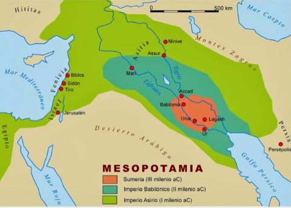
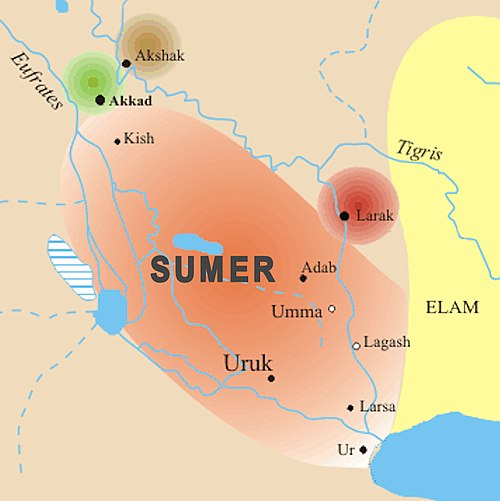
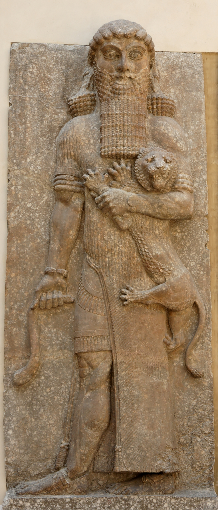
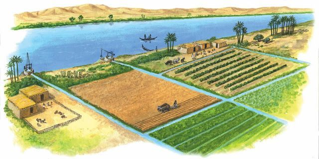
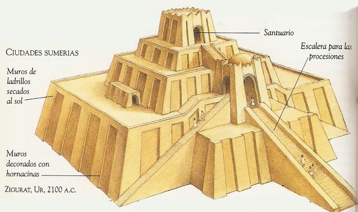

[🏠 Inicio](../index.md) | [⬅ Sección anterior](equipo.md) | [Sección siguiente ➡](seccion2.md)

---

- [1.1. Civilización elegida: Los Sumerios](#11-civilización-elegida-los-sumerios)
- [1.2. Obtención de recursos](#12-obtención-de-recursos)
  - [¿Cómo obtenían materiales, alimentos, agua, etc.?](#cómo-obtenían-materiales-alimentos-agua-etc)
  - [¿Era sostenible?](#era-sostenible)
- [1.3. Obtención de energía](#13-obtención-de-energía)
  - [Trabajo humano:](#trabajo-humano)
  - [Fuerza animal:](#fuerza-animal)
  - [Energía hidráulica:](#energía-hidráulica)
- [1.4. Posibilidades de supervivencia](#14-posibilidades-de-supervivencia)
  - [¿Cómo se adaptaban?](#cómo-se-adaptaban)
  - [¿Qué riesgos enfrentaban?](#qué-riesgos-enfrentaban)
  - [¿Qué factores llevaron a su continuidad o declive?](#qué-factores-llevaron-a-su-continuidad-o-declive)
  - [Reflexión final](#reflexión-final)
- [1.5. Análisis con respecto a los ODS (Objetivos de Desarrollo Sostenible)](#15-análisis-con-respecto-a-los-ods-objetivos-de-desarrollo-sostenible)
  - [1.5.1. ODS relevantes para el caso](#151-ods-relevantes-para-el-caso)
  - [1.5.2. Análisis, reflexión y políticas](#152-análisis-reflexión-y-políticas)
    - [Problemas con Sostenibilidad](#problemas-con-sostenibilidad)
      - [1º Salinización del suelo](#1º-salinización-del-suelo)
      - [2º Sequías y variaciones del clima](#2º-sequías-y-variaciones-del-clima)
      - [3º Crisis Agrícola](#3º-crisis-agrícola)
  - [1.5.3. Consecuencias y transición hacia la (in)sostenibilidad](#153-consecuencias-y-transición-hacia-la-insostenibilidad)
- [1.6. Los desafíos de la civilización sumeria](#16-los-desafíos-de-la-civilización-sumeria)
  - [1.6.1 Entorno natural y riesgos](#161-entorno-natural-y-riesgos)
  - [1.6.2 Entorno natural y riesgos](#162-entorno-natural-y-riesgos)
  - [1.6.3 Mitología y visión del mundo](#163-mitología-y-visión-del-mundo)
  - [1.6.4 Innovaciones y límites del progreso](#164-innovaciones-y-límites-del-progreso)
  - [1.6.5 Decadencia y legado](#165-decadencia-y-legado)

## 1.1. Civilización elegida: Los Sumerios
Los sumerios se asentaron en la Baja Mesopotamia, una fértil región conocida como Sumer, atraídos por sus ricos suelos y la disponibilidad de agua. El origen de este pueblo es un tema de debate académico conocido como la "cuestión sumeria"; mientras que algunas teorías postulan una migración, la evidencia arqueológica sugiere una clara continuidad cultural desde el período de El-Obait, lo que desafía la idea de una llegada súbita. Antes del 3000 a. C., fundaron ciudades-estado independientes, estableciendo una de las primeras civilizaciones con gobierno centralizado, religión organizada y, de manera crucial, la invención de la escritura, sentando así las bases para el desarrollo cultural y político del Cercano Oriente antiguo.

(MAPA SOBRE LA ZONA DE ASENTAMIENTO SUMERIO EN LA ANTIGUA MESOPOTAMIA)

  

## 1.2. Obtención de recursos

### ¿Cómo obtenían materiales, alimentos, agua, etc.?

Los sumerios obtenían recursos de muchas maneras, mantenían una producción de cebada, garbanzos, lentejas, mijo, trigo, nabo, dátiles, cebolla, ajo, lechuga, puerro, amapola y mostaza. También criaban vacas, ovejas, cabras y cerdos. Además, usaban bueyes como opción principal en el trabajo de carga y burros como animales de transporte. Los sumerios pescaban peces en los ríos Tigris y Éufrates y en los canales, y cazaban aves en sus orillas y desembocaduras pantanosas.

### ¿Era sostenible?

La agricultura sumeria dependía mucho del riego, efectuándose a través del uso de canales, estanques, diques y depósitos de agua. Las frecuentes y violentas inundaciones del Tigris y, en menor medida, del Éufrates hacían que los canales necesitaran de reparación frecuente y de la continua extracción del limo, y el reemplazo continuo de los marcadores de inspección y mojones. El gobierno ordenaba a esclavos, condenados a trabajos forzados, y determinados ciudadanos la tarea de trabajar en los canales, aunque los ricos podían excluirse de esta tarea.

## 1.3. Obtención de energía
   
En la civilización Sumeria, la obtención de energía estaba basada en fuentes naturales y locales, lo que podemos considerar una forma temprana de sostenibilidad.
Sus fuentes de energía principales provenían de:

### Trabajo humano: 

Fundamental para cultivar la tierra, construir canales, templos y realizar tareas diarias, aprovechando la fuerza de las personas de manera directa. Este trabajo organizado permitió que las comunidades sumerias fueran productivas y autosuficientes.

### Fuerza animal:
Empleaban animales para arar los campos y transportar mercancías. Esto aumentaba la eficiencia en la agricultura y el comercio.
Los animales eran como “máquinas de energía biológica”: transformaban alimento en fuerza de trabajo, permitiendo hacer más cosas sin depender de recursos externos limitados.

### Energía hidráulica: 
Desarrollaron sistemas de canales y riego que aprovechaban el flujo de agua de los ríos para mantener la agricultura y abastecer las ciudades. Este uso del agua como fuente de energía demuestra un aprovechamiento inteligente de los recursos naturales, contribuyendo a la sostenibilidad de la sociedad sumeria.

Gracias a estas fuentes de energía, los sumerios pudieron desarrollar una civilización organizada, eficiente y capaz de sostener a grandes poblaciones, demostrando cómo el uso equilibrado de recursos locales puede favorecer la sostenibilidad a largo plazo.

## 1.4. Posibilidades de supervivencia

### ¿Cómo se adaptaban?

Los sumerios demostraron una notable capacidad de adaptación frente a un entorno exigente. Se establecieron en una región árida, pero transformaron el paisaje mediante sistemas de riego, canales y diques que les permitieron aprovechar las crecidas del Tigris y el Éufrates para cultivar de manera continua. Esta innovación técnica fue clave para mantener la producción agrícola y sostener grandes poblaciones. Además, adaptaron sus construcciones al entorno, utilizando materiales locales como el barro y la caña, lo que reducía el impacto ambiental y la dependencia de recursos externos.

### ¿Qué riesgos enfrentaban?

Su modelo agrícola, aunque ingenioso, generaba riesgos ambientales a largo plazo. El riego constante y mal drenado provocó la acumulación de sales en el suelo (salinización), disminuyendo su fertilidad y reduciendo los rendimientos de los cultivos. También la deforestación, causada por la necesidad de madera para la construcción y el combustible, agravó la erosión y el deterioro del terreno. A nivel social, la gestión desigual del agua —controlada por las élites— generó tensiones y desigualdades que debilitaron la cohesión de las ciudades-estado.

### ¿Qué factores llevaron a su continuidad o declive?

Durante siglos, los sumerios lograron sostener su civilización gracias a su ingenio hidráulico y su organización colectiva. Sin embargo, su modelo de explotación intensiva no fue sostenible. La degradación del suelo, la pérdida de productividad agrícola y los conflictos internos por los recursos provocaron una crisis ecológica y social que acabó debilitando la región. A largo plazo, la falta de equilibrio entre el aprovechamiento y la regeneración de los recursos naturales fue uno de los principales factores que contribuyeron a su declive. Este caso refleja cómo la sostenibilidad ambiental es esencial para la supervivencia de cualquier sociedad.

### Reflexión final

El caso de los sumerios nos enseña que el progreso técnico, por sí solo, no garantiza la sostenibilidad de una civilización. Su éxito inicial en el control del agua y la expansión agrícola se convirtió, con el tiempo, en su principal amenaza al no equilibrar el uso de los recursos con su capacidad de renovación. Hoy enfrentamos retos similares: la sobreexplotación de suelos, la gestión del agua y la desigualdad en el acceso a los recursos siguen siendo problemas globales. Aprender de los errores del pasado, como el de Sumer, nos recuerda que el verdadero desarrollo sostenible implica mantener un equilibrio entre el bienestar humano, la estabilidad social y el respeto por los límites naturales del entorno.

## 1.5. Análisis con respecto a los ODS (Objetivos de Desarrollo Sostenible)

### 1.5.1. ODS relevantes para el caso
- Lista de ODS que se pueden relacionar con esta civilización o sistema.

### 1.5.2. Análisis, reflexión y políticas
- ¿Implementaron medidas sostenibles?
- ¿Qué problemas surgieron?
#### Problemas con Sostenibilidad

Los Sumerios fueron pioneros en el uso del agua para la agricultura, pero con el tiempo surgieron varios problemas de sostenibilidad que afectaron su producción y sus ciudades.

##### 1º Salinización del suelo

- Al usar sistemas de riego intensivos, el agua al evaporarse dejaba sales en la tierra.
- Como el clima era muy cálido y seco, la sal se acumulaba cada vez más.
- Con los años, los suelos perdieron fertilidad y muchas zonas se volvieron difíciles de cultivar.

##### 2º Sequías y variaciones del clima

- Dependían totalmente del agua de los ríos Tigris y Éufrates.
- Cuando había menos lluvias o los ríos bajaban su nivel, los cultivos se secaban.
- Las sequías y el calor aumentaban los efectos de la salinización.
- Además, el uso continuo de la tierra sin descanso reducía su capacidad para retener agua.

##### 3º Crisis Agrícola

- La combinación de suelos salinos, sequías y sobreexplotación redujo la productividad.
- Había menos cosechas y escasez de alimentos.
- Algunas zonas quedaron abandonadas y la población tuvo que desplazarse.

Estos tres problemas debilitaron varias ciudades sumerias.

- ¿Qué decisiones se tomaron o no se tomaron?

### 1.5.3. Consecuencias y transición hacia la (in)sostenibilidad
- ¿Qué llevó a la insostenibilidad?
- ¿Podían haber hecho algo diferente?

## 1.6. Los desafíos de la civilización sumeria

### 1.6.1 Entorno natural y riesgos

 - La baja Mesopotamia ofrecía suelos fértiles pero un clima seco y ríos con caudal impredecible

 - Los sumerios enfrentaron inundaciones, sequías y salinización del suelo, que amenazaban su agricultura y sus ciudades

 - Para sobrevivir, desarrollaron ingeniería hidráulica, pero el exceso de riego provocó problemas de fertilidad a largo plazo

 

  
   
  <em>Mapa de Sumer: ubicación de donde vivían los sumerios y sus principales ríos</em>

### 1.6.2 Entorno natural y riesgos

 - La escasez de recursos y la concentración del poder en templos y élites provocaron tensiones internas y rivalidades entre ciudades-estado

 - Los conflictos eran un factor adicional que dificultaba la sostenibilidad y la estabilidad

### 1.6.3 Mitología y visión del mundo

 - La religión sumeria conectaba naturaleza y divinidad

 - Los fenómenos naturales eran vistos como castigos o pruebas de los dioses, y los sacerdotes dirigían la vida política y económica

  
   
  <em>Gilgamesh enfrentando desafíos naturales y sociales</em>

 - El mito de Gilgamesh: el rey de Uruk busca la inmortalidad enfrentando desiertos, monstruos y diluvios, aprendiendo que los humanos tienen límites y deben aceptar su destino, dejando un legado a través de sus obras

 - Este mito ilustra cómo los sumerios interpretaban sus desafíos naturales y sociales, y cómo los enfrentaban con ingenio y cooperación

### 1.6.4 Innovaciones y límites del progreso

 - Crearon canales de riego, templos y sistemas de administración para gestionar recursos y población

  
   
  <em>Canales de riego sumerios: ingenio frente a desafíos naturales</em>

 - Estas innovaciones aumentaron la productividad y la organización, pero también intensificaron problemas como la salinización y el agotamiento de suelos

 - Enseñanza: el progreso humano necesita equilibrio con la naturaleza

### 1.6.5 Decadencia y legado

 - Hacia el 2000 a.C., las ciudades sumerias sufrieron declive por factores ambientales y sociales

 - Su legado incluye escritura cuneiforme, zigurats y mitos que influyeron en civilizaciones posteriores

  
   
  <em>Zigurat: templo sumerio, centro religioso y administrativo</em>

 - Sirve como advertencia y enseñanza sobre sostenibilidad y gestión de recursos: sin equilibrio, incluso una civilización avanzada puede colapsar

---

[🏠 Inicio](../index.md) | [⬅ Sección anterior](equipo.md) | [Sección siguiente ➡](seccion2.md)
